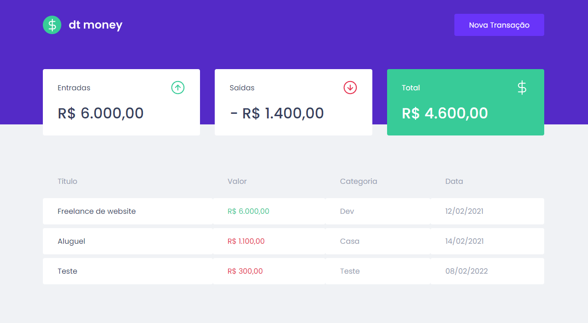

<h1 align="center">dt money</h1>

<p align="center">
  
</p>

# 💻 Projeto
O dt money é um controle de finanças pessoas, possibilitando o cadastro de entradas e saídas e obteção do total.

# 🚀 Techs
* React
* Styled-Components
* Typescript
* Axios
* MirageJS
* Polished

# 🎨 Style

#### Cores:

```css
:root {
  --blue: #5429CC;
  --red: #E62E4D;
  --green: #33CC95;
  --blue-light: #6933FF;
  
  --text-title: #363F5F;
  --text-body: #969CB3;
  --input-background: #E7E9EE;
  
  --background: #F0F2F5;
  --shape: #FFFFFF;
}
```

#### Tipo de fonte:
font-family: Poppins
font-weight: 400, 500 e 600
Você pode encontrar a fonte no [Google Fonts](https://fonts.google.com/)

